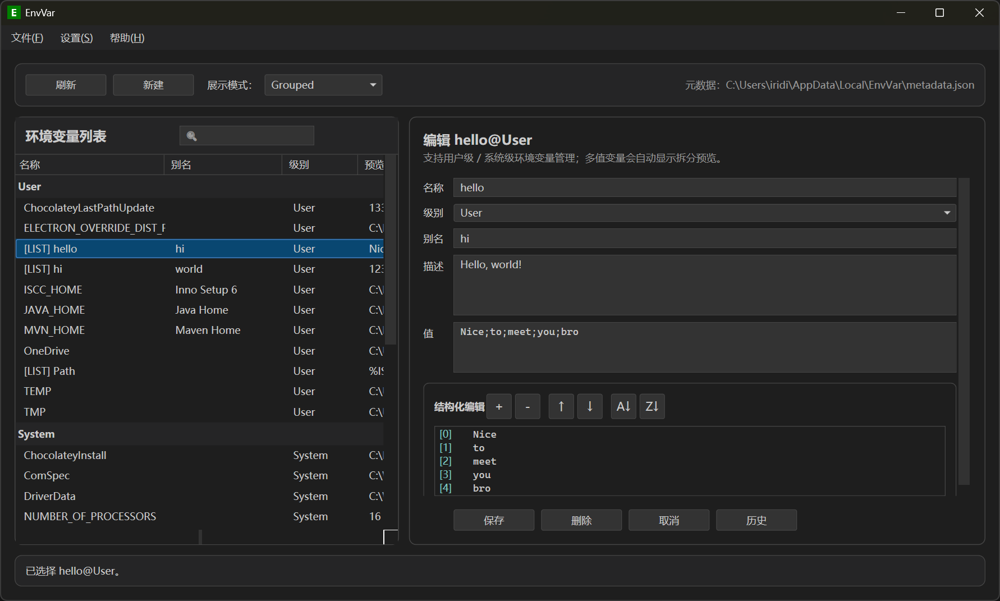

# EnvVar

[English](./README.md) | 简体中文 | [繁體中文](./README.zh-TW.md)

一个面向 Windows 的环境变量可视化管理工具，使用 .NET 10 / WPF 构建。



## 下载

[](https://github.com/iridiumcao/EnvVar/releases/latest)

您可以从 [Releases](https://github.com/iridiumcao/EnvVar/releases/latest) 页面下载最新的安装程序。

### Windows 安全提示（请仔细阅读）

由于本项目是全新的开源软件，且尚未申请代码签名证书，Windows SmartScreen 可能会弹出以下警告：

- `Windows 已保护你的电脑`
- `Microsoft Defender SmartScreen 阻止了无法识别的应用启动`

解决方法：点击 **仍要运行** 即可继续安装。

本软件完全开源、无病毒，您也可以自行查看源码验证。

VirusTotal 检测结果：**1/70**。仅 1 个机器学习引擎误报，其余 69 个安全厂商均未检测到问题。

这是新 Inno Setup 安装包的常见误报，并非真正问题。完整 VirusTotal 报告：
https://www.virustotal.com/gui/file/15c7f347097e9084aa25e8ab4d7aff1250d7528df0131981f2b4845103f0c48e/detection

## 功能

- 浏览用户级与系统级环境变量
- 合并展示或按级别分组展示，支持按列排序
- 新建、编辑、删除环境变量
- 编辑本地扩展信息（Alias / Description），常见变量内置预设描述
- 实时搜索过滤（按名称、别名、值），搜索框带放大镜暗示
- 多值变量（如 PATH）结构化编辑：逐项编辑、添加、删除、移动、排序
- 导入 / 导出为 JSON 文件
- 自动记录单变量历史版本（数量可配置，默认 5 个），支持按变量独立查看和恢复
- 内置按天滚动的日志系统，可记录生命周期事件、关键操作和未捕获异常
- 未保存修改提醒：切换变量或关闭窗口前自动检查并提示保存
- 多语言支持：English / 简体中文 / 繁體中文（选择持久化）
- 主题支持：浅色 / 深色 / 跟随系统（主题持久化）
- 权限不足时提示以管理员身份重启

## 本地数据

为了避免污染真实环境变量，`Alias` 与 `Description` 会单独保存在本地 JSON 文件中。

| 数据 | 路径 |
|------|------|
| 元数据 | `%LocalAppData%\EnvVar\metadata.json` |
| 变量历史 | `%LocalAppData%\EnvVar\history.json` |
| 应用设置 | `%LocalAppData%\EnvVar\settings.json` |
| 日志 | `%LocalAppData%\EnvVar\Logs\YYYY-MM-DD.log` |

元数据键格式：`Name@Level`

```json
{
  "JAVA_HOME@User": {
    "alias": "Java Home",
    "description": "JDK installation path"
  }
}
```

## 使用说明

1. 启动应用后，左侧显示环境变量列表，右侧显示编辑面板。
2. 点击任意变量可查看和编辑其内容。
3. 点击「新建」进入创建模式。
4. 点击「保存」写入注册表和本地元数据。
5. 点击「删除」会先进行确认。
6. 若变量值包含 `;`，右侧会显示结构化编辑区，可逐项编辑、添加、删除、移动和排序。
7. 编辑已有变量时，点击「历史」按钮可查看该变量的历史版本并恢复。
8. 通过「文件」菜单进行导出 / 导入。
9. 通过「设置」菜单切换语言、主题、显示别名列、最大历史记录和日志，选择会被自动记录。

## 权限说明

- 用户级变量通常可直接修改。
- 系统级变量需要管理员权限；权限不足时会提示以管理员身份重新启动。

## 开发

项目基于 .NET 10 / WPF：

```bash
dotnet build
```

### 项目结构

| 目录 / 文件 | 说明 |
|-------------|------|
| `MainWindow.xaml(.cs)` | 主窗口 |
| `ViewModels/` | ViewModel 层 |
| `Models/` | 数据模型（条目、设置、历史、日志） |
| `Services/` | 业务服务（环境变量读写、元数据、导入导出、历史记录、日志、多语言、设置、主题） |
| `Infrastructure/` | 基础设施（ObservableObject） |
| `Utilities/` | 工具类（多值解析） |
| `Views/` | 子窗口（About、Settings、自定义消息框） |
| `Resources/Languages/` | 多语言资源文件 |
| `docs/` | 文档 |
| `installer/` | 安装程序脚本 (Inno Setup) |

## 单元测试

本项目包含使用 **xUnit** 和 **Moq** 编写的完整单元测试套件。

运行测试：

```bash
dotnet test
```

更多详细信息请参阅 [测试文档](docs/testing.md)。

## 文档

- [功能设计文档](docs/design.md)
- [UI 设计文档](docs/ui-design.md)
- [测试文档](docs/testing.md)
- [建议与改进方案](docs/suggestions.md)
- [安装包构建指南](installer/BUILD.md)

## 构建安装程序

该项目使用 [Inno Setup 6](https://jrsoftware.org/isdl.php) 创建 Windows 安装程序。

### 本地构建
1. 确保已安装 .NET 10 SDK 和 Inno Setup 6。
2. 运行构建脚本：
   ```powershell
   ./installer/build-installer.ps1 -version 1.0.0
   ```
3. 生成的安装程序将位于 `release/` 目录中。

### 自动化构建 (GitHub Actions)
项目包含 GitHub Actions 工作流，用于自动构建和发布：
- **推送/PR 到 main 分支**: 构建安装程序并作为工作流制品 (Artifact) 上传。
- **打标签 (`v*`)**: 使用标签版本号构建安装程序并创建 GitHub Release。

更多详情，请参阅 [安装包构建指南](installer/BUILD.md)。
