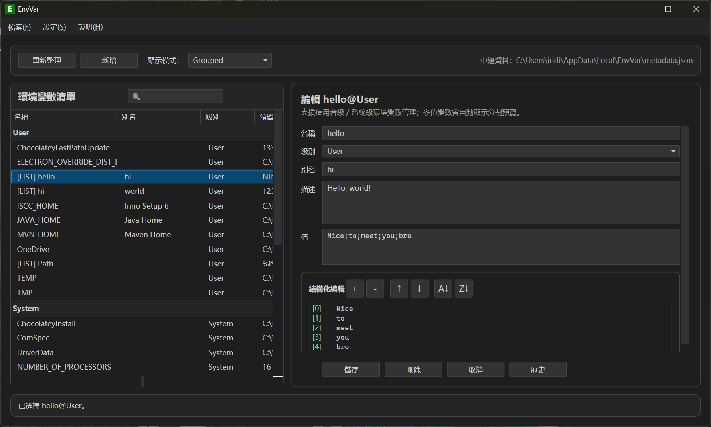

# EnvVar

[English](./README.md) | [简体中文](./README.zh-CN.md) | 繁體中文

一個面向 Windows 的環境變數視覺化管理工具，使用 .NET 10 / WPF 構建。



## 下載

[](https://github.com/iridiumcao/EnvVar/releases/latest)

您可以從 [Releases](https://github.com/iridiumcao/EnvVar/releases/latest) 頁面下載最新的安裝程式。

## 功能

- 瀏覽使用者級與系統級環境變數
- 合併展示或按層級分組展示，支援按列排序
- 新建、編輯、刪除環境變數
- 編輯本地擴展資訊 (Alias / Description)，常見變數內建預設描述
- 即時搜尋過濾（按名稱、別名、值），搜尋框帶放大鏡暗示
- 多值變數（如 PATH）結構化編輯：逐項編輯、添加、刪除、移動、排序
- 匯入 / 匯出為 JSON 檔案
- 自動記錄單一變數歷史版本（數量可配置，預設 5 個），支援按變數獨立查看和還原
- 內建按天滾動的日誌系統，可記錄生命週期事件、關鍵操作與未捕獲例外
- 未儲存修改提醒：切換變數或關閉視窗前自動檢查並提示儲存
- 多語言支援：English / 簡體中文 / 繁體中文（選擇持久化）
- 主題支援：淺色 / 深色 / 跟隨系統（主題持久化）
- 權限不足時提示以管理員身份重啟

## 本地數據

為了避免污染真實環境變數，`Alias` 與 `Description` 會單獨儲存在本地 JSON 檔案中。

| 數據 | 路徑 |
|------|------|
| 元數據 | `%LocalAppData%\EnvVar\metadata.json` |
| 變數歷史 | `%LocalAppData%\EnvVar\history.json` |
| 應用設定 | `%LocalAppData%\EnvVar\settings.json` |
| 日誌 | `%LocalAppData%\EnvVar\Logs\YYYY-MM-DD.log` |

元數據鍵格式：`Name@Level`

```json
{
  "JAVA_HOME@User": {
    "alias": "Java Home",
    "description": "JDK installation path"
  }
}
```

## 使用說明

1. 啟動應用後，左側顯示環境變數列表，右側顯示編輯面板。
2. 點擊任意變數可查看和編輯其內容。
3. 點擊「新建」進入建立模式。
4. 點擊「儲存」寫入登錄檔和本地元數據。
5. 點擊「刪除」會先進行確認。
6. 若變數值包含 `;`，右側會顯示結構化編輯區，可逐項編輯、添加、刪除、移動和排序。
7. 編輯已有變數時，點擊「歷史」按鈕可查看該變數的歷史版本並恢復。
8. 透過「檔案」選單進行匯出 / 匯入。
9. 透過「設定」選單切換介面語言、主題；`最大歷史記錄` 保持獨立，日誌透過單獨的 `日誌` 項管理，選擇會自動記住。

## 權限說明

- 使用者級變數通常可直接修改。
- 系統級變數需要管理員權限；權限不足時會提示以管理員身份重新啟動。

## 開發

專案基於 .NET 10 / WPF：

```bash
dotnet build
```

### 專案結構

| 目錄 / 檔案 | 說明 |
|-------------|------|
| `MainWindow.xaml(.cs)` | 主視窗 |
| `ViewModels/` | ViewModel 層 |
| `Models/` | 數據模型（條目、設定、歷史、日誌） |
| `Services/` | 業務服務（環境變數讀寫、元數據、匯入匯出、歷史記錄、日誌、多語言、設定、主題） |
| `Infrastructure/` | 基礎設施（ObservableObject） |
| `Utilities/` | 工具類（多值解析） |
| `Views/` | 子視窗（About、Settings、自訂訊息框） |
| `Resources/Languages/` | 多語言資源檔案 |
| `docs/` | 文檔 |
| `installer/` | 安裝程式腳本 (Inno Setup) |

## 單元測試

本項目包含使用 **xUnit** 和 **Moq** 編寫的完整單元測試套件。

運行測試：

```bash
dotnet test
```

更多詳細信息請參閱 [測試文檔](docs/testing.md)。

## 文檔

- [功能設計文檔](docs/design.md)
- [UI 設計文檔](docs/ui-design.md)
- [測試文檔](docs/testing.md)
- [建議與改進方案](docs/suggestions.md)
- [安裝包構建指南](installer/BUILD.md)

## 構建安裝程式

該項目使用 [Inno Setup 6](https://jrsoftware.org/isdl.php) 建立 Windows 安裝程式。

### 本地構建
1. 確保已安裝 .NET 10 SDK 和 Inno Setup 6。
2. 運行構建腳本：
   ```powershell
   ./installer/build-installer.ps1 -version 1.0.0
   ```
3. 生成的安裝程式將位於 `release/` 目錄中。

### 自動化構建 (GitHub Actions)
專案包含 GitHub Actions 工作流，用於自動構建和發佈：
- **推送/PR 到 main 分支**: 構建安裝程式並作為工作流製品 (Artifact) 上傳。
- **打標籤 (`v*`)**: 使用標籤版本號構建安裝程式並建立 GitHub Release。

更多詳情，請參閱 [安裝包構建指南](installer/BUILD.md)。
